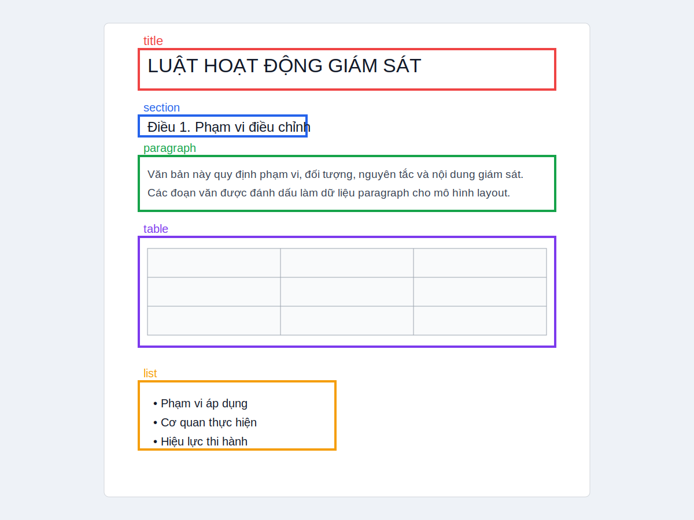
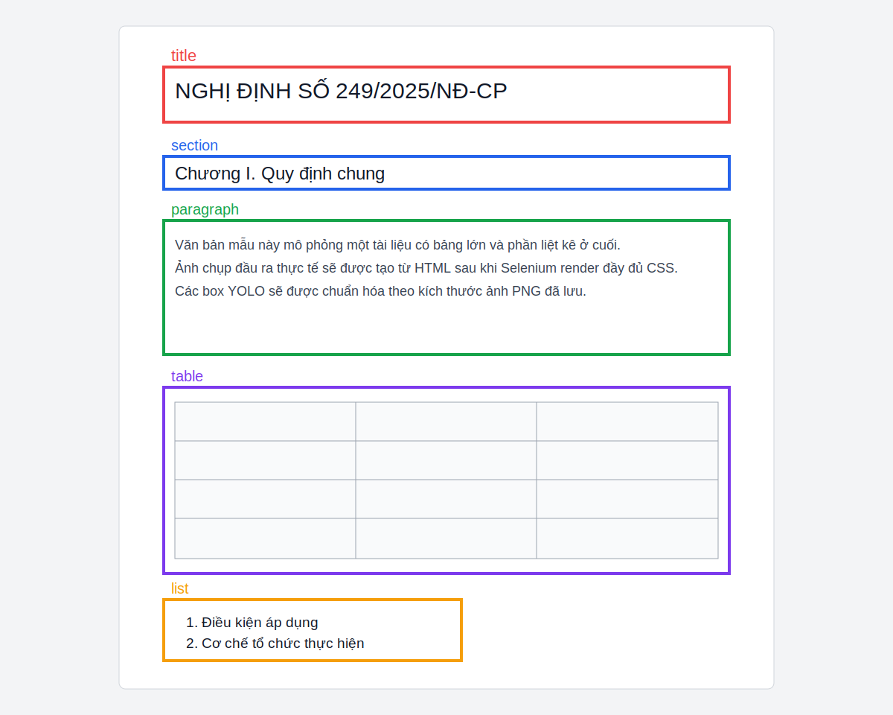
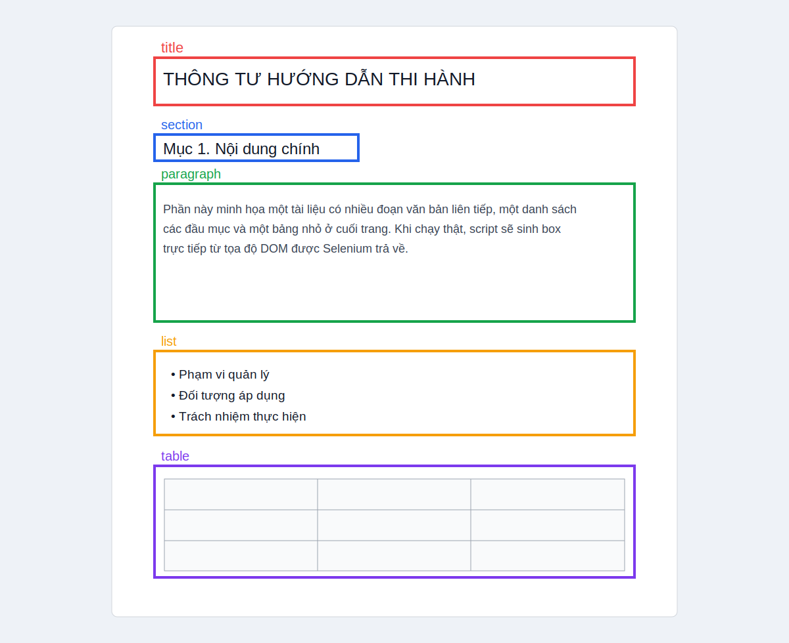

# VBPL Layout Dataset and YOLO Training Project

This project crawls legal documents from `https://vbpl.vn/`, saves static HTML snapshots, renders those snapshots into images with YOLO annotations, and fine-tunes a YOLOv8 model for document layout detection.

## Project structure

```text
project/
├── crawler/
│   ├── crawl_vbpl.py
│   └── requirements_crawl.txt
├── data/
│   ├── raw_html/
│   │   └── .gitkeep
│   └── synthetic_dataset/
│       ├── images/
│       ├── labels/
│       ├── classes.txt
│       ├── train.txt
│       ├── val.txt
│       └── dataset.yaml
├── docs/
│   └── sample_outputs/
│       ├── sample_output_01.svg
│       ├── sample_output_02.svg
│       └── sample_output_03.svg
├── models/
│   └── .gitkeep
├── scripts/
│   ├── generate_dataset.py
│   ├── predict_layout.py
│   └── train_yolo.py
├── requirements.txt
└── README.md
```

## What the pipeline does

1. `crawler/crawl_vbpl.py`
   - Collects VBPL document URLs from public sitemap files referenced by `robots.txt`.
   - Optionally walks browser index pages such as `/van-ban/trung-uong`.
   - Opens each document page in Chrome, waits for the live content to hydrate, marks the document content root, strips scripts, and saves a static HTML snapshot into `data/raw_html/`.
   - Maintains `manifest.jsonl` and `crawl_state.json` so the crawl is restartable.

2. `scripts/generate_dataset.py`
   - Reads every saved HTML snapshot.
   - Extracts the marked content root and rewraps it into a light-weight render page with the original CSS links.
   - Uses headless Chrome to render the page.
   - Captures a stitched full-page screenshot into `data/synthetic_dataset/images/`.
   - Extracts bounding boxes for `title`, `section`, `paragraph`, `table`, and `list`.
   - Writes YOLO labels to `data/synthetic_dataset/labels/`.
   - Creates `classes.txt`, `train.txt`, `val.txt`, and `dataset.yaml`.

3. `scripts/train_yolo.py`
   - Fine-tunes YOLOv8 on the generated dataset.
   - Uses GPU automatically if available.
   - Falls back to CPU with a warning if CUDA is unavailable.
   - Copies the best checkpoint to `models/best.pt`.
   - Exports metrics to `models/training_metrics.csv`, `models/training_summary.json`, and TensorBoard logs in `models/tensorboard/`.

4. `scripts/predict_layout.py`
   - Runs inference on one image or a folder.
   - Saves annotated images and bounding box coordinates to `models/predictions/`.

## Environment

- Python: `3.9+`
- Operating systems: Windows and Linux
- Browser: Google Chrome or Chromium
- Driver: Selenium 4.15 uses Selenium Manager, which normally resolves ChromeDriver automatically

If Selenium Manager cannot find or download a driver on your machine:

1. Install a matching ChromeDriver manually.
2. Put it on your `PATH`.
3. Re-run the command.

## Installation

### Windows PowerShell

```powershell
cd project
python -m venv .venv
.venv\Scripts\Activate.ps1
python -m pip install --upgrade pip
pip install -r requirements.txt
```

### Linux

```bash
cd project
python3 -m venv .venv
source .venv/bin/activate
python -m pip install --upgrade pip
pip install -r requirements.txt
```

If you only want to run the crawler:

```bash
pip install -r crawler/requirements_crawl.txt
```

## Step 1: Crawl VBPL documents

### Recommended command

```bash
python crawler/crawl_vbpl.py --target-count 1000 --scope trung-uong --seed-mode sitemap
```

### Useful options

```bash
python crawler/crawl_vbpl.py --target-count 500 --scope dia-phuong --seed-mode sitemap
python crawler/crawl_vbpl.py --target-count 800 --scope all --seed-mode both
python crawler/crawl_vbpl.py --target-count 50 --scope trung-uong --seed-mode index --no-headless
```

### Notes

- The crawler respects `robots.txt` and sleeps `1-2` seconds between requests by default.
- The default discovery mode is `sitemap` because the current VBPL site publishes public XML sitemaps and the detail pages are client-rendered.
- `--seed-mode index` uses Selenium to paginate through browser index pages.
- Restart support is automatic:
  - `data/raw_html/manifest.jsonl`
  - `data/raw_html/crawl_state.json`
- To re-download everything from scratch, add `--force-refresh`.

### Manual steps if the site shows consent or CAPTCHA

If VBPL presents a cookie banner, bot check, or interactive gate:

```bash
python crawler/crawl_vbpl.py --target-count 50 --scope trung-uong --no-headless
```

Then:

1. Accept the prompt once in the browser window.
2. Let the crawler continue.
3. Re-run in headless mode after the first successful pass if you want.

## Step 2: Generate the synthetic dataset

### Recommended command

```bash
python scripts/generate_dataset.py
```

### Useful options

```bash
python scripts/generate_dataset.py --limit 100
python scripts/generate_dataset.py --window-width 1200 --viewport-height 1600
python scripts/generate_dataset.py --overwrite
python scripts/generate_dataset.py --no-headless
```

### What to expect

- Rendering can take hours for `500-1000` documents.
- A progress bar is shown with `tqdm`.
- Each output image is a full-page stitched screenshot.
- Each output label file uses standard YOLO format:

```text
class_id x_center y_center width height
```

- Class order in `classes.txt` is:

```text
0 title
1 section
2 paragraph
3 table
4 list
```

### Complex tables and nested elements

The renderer preserves external CSS and inline styles from the saved snapshot. It also:

- Reuses the crawled DOM root marked during crawling.
- Neutralizes sticky and fixed elements before stitching the screenshot.
- Detects tables directly from `<table>`.
- Detects paragraphs from `<p>` and VBPL content blocks such as `prov-content`.
- Detects section headings from headings and VBPL structural classes such as `prov-article`.

## Step 3: Train YOLO

### Recommended command

```bash
python scripts/train_yolo.py --epochs 75 --batch 8 --imgsz 640
```

### Useful options

```bash
python scripts/train_yolo.py --epochs 100 --batch 16
python scripts/train_yolo.py --device cpu
python scripts/train_yolo.py --force-split
```

### GPU recommendation

- Minimum practical setup: `8 GB` VRAM with `batch 8`
- Better throughput: `12-24 GB` VRAM with `batch 16`
- CPU mode works, but training will be significantly slower

### Outputs

- Best model: `models/best.pt`
- Pretrained base checkpoint: `models/yolov8n.pt` when downloaded automatically
- CSV metrics: `models/training_metrics.csv`
- Summary JSON: `models/training_summary.json`
- TensorBoard scalars: `models/tensorboard/`
- Full Ultralytics run folder: `runs/detect/vbpl_layout/` by default

To inspect TensorBoard logs:

```bash
tensorboard --logdir models/tensorboard
```

## Step 4: Run inference

### Single image

```bash
python scripts/predict_layout.py path/to/image.png
```

### Folder of images

```bash
python scripts/predict_layout.py path/to/folder --conf 0.25 --imgsz 640
```

### Outputs

The script writes to `models/predictions/`:

- Annotated images
- JSON files with coordinates
- TXT files with readable box summaries
- `predictions.json` manifest

## Example output

The images below are illustrative samples of the expected layout annotations.







Example YOLO label file:

```text
0 0.507812 0.067500 0.742188 0.052500
1 0.186719 0.182500 0.220313 0.031250
2 0.501563 0.257500 0.857813 0.062500
3 0.500000 0.512500 0.875000 0.180000
4 0.310938 0.760000 0.365625 0.105000
```

## Practical limitations

- Some VBPL entries may only expose metadata or attached PDF previews instead of full HTML text. Those pages still crawl correctly, but the generated annotation set may be sparse.
- Very long documents produce very tall screenshots. The dataset generator uses stitched viewport captures to avoid common Chrome full-page screenshot limits.
- Because the live site can change, selectors are intentionally defensive and not tied to one brittle CSS class.

## Quick start

```bash
python crawler/crawl_vbpl.py --target-count 1000 --scope trung-uong --seed-mode sitemap
python scripts/generate_dataset.py
python scripts/train_yolo.py --epochs 75 --batch 8
python scripts/predict_layout.py data/synthetic_dataset/images
```
